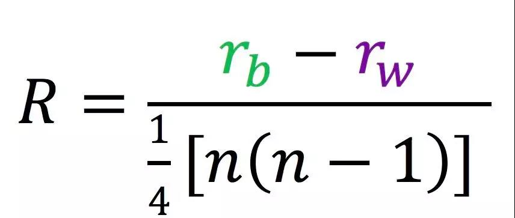

Metagenomics overview and materials
===================================

description
--------------------

Methods and visualization in Metageomics

Prerequisites and Preparation
-----------------------------

Prior to the workshop you should:

- install R from <https://cran.r-project.org/>
- install RStudio from <https://www.rstudio.com/products/rstudio/download/#download>


```{r setup, include=FALSE}
knitr::opts_chunk$set(echo=T, warning=F, message=F)
library(ggplot2)
library(RColorBrewer)
```


alpha diverstiy
---------------
```{r}
# library
library(scales)
library(vioplot)
library(reshape2)
library(tidyr)

# load data 
phen <- read.table("../dataSet/design.txt", header = T, row.names = 1, sep = "\t")
alpha <- read.delim("../dataSet/alpha.txt", header = T, row.names = 1, sep = "\t")

# merge data 
index <- cbind(alpha, phen[match(rownames(alpha), rownames(phen)), ])

# plot and save 
ggplot(index, aes(x=genotype, y=observed_otus, color=genotype))+
  stat_boxplot(geom="errorbar",
               width=0.15,
               aes(color=genotype))+
  geom_boxplot(alpha=1, outlier.size=0, 
               size=0.7, width=0.5, 
               fill="transparent")+
  geom_jitter(position=position_jitter(0.17), 
              size=1, alpha=0.7)+
  labs(x="Groups", y="observed_otus index")+
  theme_bw()+
  theme(axis.title=element_text(size=16,face="bold"),
		    plot.title = element_text(hjust = 0.5, size = 14),
		    text=element_text(size=14,face="bold"),
		    axis.text.x = element_text(size=12,vjust=0.5,hjust = 0.5,angle=45))


# 统计组间是否显著差异  anova对指数与分组统计
observed_otu  <- aov(observed_otus~genotype , data = index)
Tukey <- TukeyHSD(observed_otu, ordered = FALSE, conf.level = 0.9)
Tukey_result <- as.data.frame(Tukey$genotype)
Tukey_result
```


[Linear discriminant analysis](https://en.wikipedia.org/wiki/Linear_discriminant_analysis)
------------------------------------------------------------------------------------------
```{r}
# library
library(MASS)
library(ggord)
#devtools::install_github("fawda123/ggord")
library(plyr)

# load data 
ord <- lda(Species ~ ., iris, prior = rep(1, 3)/3)

get_lda_ell <- function(ord_in, grp_in, ellipse_pro = 0.97){
  axes <- c('LD1', 'LD2')
  obs <- data.frame(predict(ord_in)$x[, axes])
  obs$Groups <- grp_in
  names(obs)[1:2] <- c('one', 'two')
  theta <- c(seq(-pi, pi, length = 50), seq(pi, -pi, length = 50))
  circle <- cbind(cos(theta), sin(theta))
  ell <- ddply(obs, 'Groups', function(x) {
    if(nrow(x) <= 2) {
      return(NULL)
    }
    sigma <- var(cbind(x$one, x$two))
    mu <- c(mean(x$one), mean(x$two))
    ed <- sqrt(qchisq(ellipse_pro, df = 2))
    data.frame(sweep(circle %*% chol(sigma) * ed, 2, mu, FUN = '+'))
  })
  names(ell)[2:3] <- c('one', 'two')
  ell <- ddply(ell, .(Groups), function(x) x[chull(x$one, x$two), ])
  return(ell)
}

# 计算置信椭圆，并添加至原图
anotherEll <- get_lda_ell(ord, iris$Species, 0.97)
ggord(ord, iris$Species)+
  geom_polygon(data = anotherEll, 
  aes_string(color = 'Groups', group = 'Groups'),
  lty=2, fill = NA)
```


PCA :基于样本相似系数矩阵（欧式距离）来寻找住成分 [数据变换，投影， 方差最大]
-----------------------------------------------------------------------------
```{r}
# library
library(plyr)
library(ggbiplot)
# devtools::install_github("vqv/ggbiplot")
library(vegan)

# load data 
phe <- read.table("../dataSet/design.txt", header = T, row.names = 1, sep = "\t")
otu <- read.delim("../dataSet/otu_table.txt", header = T, row.names = 1, sep = "\t")
bray <- read.table("../dataSet/bray_curtis_otu_table_css.txt", header = T, check.names = F, sep = "\t")
otu.css <- read.table("../dataSet/otu_table_css.txt", sep="\t", header=T, row.names= 1) 

phe.glt <- phe[rownames(phe)%in%colnames(otu), ]
otu.prf <- otu[, rownames(phe.glt)]

# PCA no normalization
otu.pca <- prcomp(t(otu.prf), scale. = TRUE)
ggbiplot(otu.pca, obs.scale = 1, 
         var.scale = 1, 
         groups = phe.glt$genotype
         ,ellipse = TRUE, 
         var.axes=F)+
  theme_bw()+
  theme(axis.title=element_text(size=16,face="bold"),
            plot.title = element_text(hjust = 0.5, size = 14),
            text=element_text(size=14,face="bold"),
            axis.text.x = element_text(size=12,vjust=0.5,hjust = 0.5,angle=45))

# transform origin data into percentage
otu.norm <- t(t(otu.prf)/colSums(otu.prf, na=T))*100
mad.5 <- otu.norm[apply(otu.norm, 1, mad) > 0.5, ]  ## filter

# mad.5 <- head(norm[order(apply(norm,1,mad), decreasing=T), ], n=7)
otu.pca.2 <- prcomp(t(mad.5))
ggbiplot(otu.pca.2, obs.scale = 1, 
         var.scale = 1, 
         groups = phe.glt$genotype,
         ellipse = TRUE, var.axes = T)+
  theme_bw()+
  theme(axis.title=element_text(size=16,face="bold"),
            plot.title = element_text(hjust = 0.5, size = 14),
            text=element_text(size=14,face="bold"),
            axis.text.x = element_text(size=12,vjust=0.5,hjust = 0.5,angle=45))
```

> 1. 我们仅用中值绝对偏差(mad)最大的6个OTUs进行主成分分析，即可将三组样品明显分开。
> 2. 图中向量长短代表差异贡献，方向为与主成分的相关性。
> 3. 可以看到最长的向量与X轴近平行，表示PC1的差异主要由此菌贡献。
> 4. 其它菌与其方向相反代表OTUs间可能负相关；夹角小于90%的代表两个OTUs有正相关


PCoA : 基于距离矩阵（欧式距离以外其他距离）寻找主坐标 
-----------------------------------------------------
```{r}
# filter data 
phe.coa <- phe[rownames(phe)%in%colnames(bray), ]
bray.coa <- bray[rownames(phe.coa), rownames(phe.coa)]  # sort names 

# bray transform to pcoa
pcoa <- cmdscale(bray.coa, k=3, eig = T) # k is dimension, 3 is recommended; eig is eigenvalues
points <-  as.data.frame(pcoa$points) # get coordinate string, format to dataframme
colnames(points) <- c("x", "y", "z")
eig <- pcoa$eig
dat <- cbind(points, phe.coa[match(rownames(points), rownames(phe.coa)), ])

# plot & save 
ggplot(dat, aes(x=x, y=y, color=genotype))+
  geom_point(alpha=.7, size=2)+ 
  labs(x=paste("PCoA 1 (", format(100*eig[1]/sum(eig), digits=4), "%)", sep=""),
  y=paste("PCoA 2 (", format(100*eig[2]/sum(eig), digits=4), "%)", sep=""),
  title="bray_curtis PCoA")+
  theme_bw()+
  theme(axis.title=element_text(size=16,face="bold"),
            plot.title = element_text(hjust = 0.5, size = 14),
            text=element_text(size=14,face="bold"),
            axis.text.x = element_text(size=12,vjust=0.5,hjust = 0.5,angle=45))


# 区分不明显的组计算p值
phe.coa1 <-  subset(phe.coa, (genotype%in%c("WT","KO")))
bray.coa1 <- bray.coa[rownames(phe.coa1), rownames(phe.coa1)]
bray_result <- as.dist(bray.coa1, diag = FALSE, upper = FALSE)
adonis_table <-  adonis(bray_result ~ genotype, data=phe.coa1, permutations = 10000) 
pvalue <- adonis_table$aov.tab$`Pr(>F)`[1]
```

> 1. 图中WT和OE在第一轴明显分开的，但WT与KO间区分不明显，是否存在显著差别呢 
> 2. 通常PCoA展示的是所有样品间的最大差异,而想要找到组间差异，需要限制条件的主坐标轴分析


CCA [Canonical correspondence analysis](https://en.wikipedia.org/wiki/Canonical_correspondence_analysis)
--------------------------------------------------------------------------------------------------------
```{r}
# CCA分析功能函数
variability_table <- function(cca){
  chi <- c(cca$tot.chi, cca$CCA$tot.chi, cca$CA$tot.chi)
  variability_table = cbind(chi, chi/chi[1])
  colnames(variability_table) = c("inertia", "proportion")
  rownames(variability_table) = c("total", "constrained", "unconstrained")
  return(variability_table)
}

# 读入CSS标准化的OTU表，并与实验设计比对筛选和数据重排
phe.css <- phe[rownames(phe)%in%colnames(otu.css) ,]
otu.css1 <- otu.css[, rownames(phe.css)] 

# Constrained analysis OTU table by genotype
capscale.gen <- capscale(t(otu.css1) ~ genotype, 
                         data=phe.css, add=F, sqrt.dist=T, distance="bray") 

# ANOVA-like permutation analysis
perm_anova.gen <- anova.cca(capscale.gen)

# generate variability tables and calculate confidence intervals for the variance
var_tbl.gen <- variability_table(capscale.gen)
eig <- capscale.gen$CCA$eig
variance <- var_tbl.gen["constrained", "proportion"]
p.val <- perm_anova.gen[1, 4]

# extract the weighted average (sample) scores
points <- capscale.gen$CCA$wa[, 1:2]
points <- as.data.frame(points)
colnames(points) <- c("x", "y")
dat <- cbind(points, phe.css[match(rownames(points), rownames(phe.css)),])

# plot CPCo 1 and 2
ggplot(dat, aes(x=x, y=y, color=genotype)) +
  geom_point(alpha=.7, size=1.5)+
  labs(x=paste("CPCoA 1 (", format(100 * eig[1] / sum(eig), digits=4), "%)", sep=""),
  y=paste("CPCoA 2 (", format(100 * eig[2] / sum(eig), digits=4), "%)", sep="")) + 
  ggtitle(paste(format(100 * variance, digits=3), " % of variance; p=",format(p.val, digits=2),sep=""))+
  theme_bw()+
  theme(axis.title=element_text(size=16,face="bold"),
            plot.title = element_text(hjust = 0.5, size = 14),
            text=element_text(size=14,face="bold"),
            axis.text.x = element_text(size=12,vjust=0.5,hjust = 0.5,angle=45))
```

> 图中三个组能明显分开，代表组间存在一致的差异。顶部展示21.2%表示组间的差异占总体的比例，p=0.001表示组间有显著差异。两轴百分比是此平面下可解释差异的百分比


**ANOSIM**（analysis of similarities）分析，也叫[相似性分析](https://en.wikipedia.org/wiki/Analysis_of_similarities)
--------------------------------------------------------------------------------------------------------------------

#### 1. Definition : 主要是用于分析高维度数据组间相似性的统计方法，比如我们经常做完PCoA、NMDS等降维分析的时候（如下图），看着组间样本是区分开的，但是缺少一个P值，说明这种差异到底是否显著

#### 2. ****

#### 3. **解释**

> R < 0，表示组内差异大于组间差异，说明有可能实验设计存在缺陷，或者用于分析的数据存在问题

> R = 0，表示组间没有差异，说明实验组和对照组之间没有差异

> R > 0，表示组间差异大于组内差异，说明实验组和对照组之间存在差异

#### 4. **后续工作**置换检验得到P值，说明实验组和对照组之间存在差异
1) 对原始样本随机分组，分为实验组和对照组，
2) 计算随机分组的Ri值，并和R比较（Ri > R），
3) 并重复1000次，
4) 计算p = Ri 大于 R的百分比，p< 0.05，说明实验组和对照组显著差异

```{r}
# library
library(vegan)

# load data
dat <- iris

# deal 
dat.dis <- vegdist(subset(dat, select = -Species))
m <- monoMDS(dat.dis)
dat.point <- as.data.frame(m$points)
dat.point$gr <- dat$Species

# NMDS method: dissimilarity
ggplot(dat.point, aes(x=MDS1, y=MDS2, col=gr, shape=gr))+
  geom_point(size=1.8, alpha=.6)+
  theme_bw()+
  theme(axis.title=element_text(size=16,face="bold"),
            plot.title = element_text(hjust = 0.5, size = 14),
            text=element_text(size=14,face="bold"),
            axis.text.x = element_text(size=12,vjust=0.5,hjust = 0.5,angle=45)) 

# ANOSIM : R value and p value 
ano <- anosim(dat.dis, dat$Species, permutations = 99)
summary(ano)

## plot
plot(ano)
```

1. 从上图我们可以看出R = 0.858 > 0, p = 0.001, 说明组间差异显著大于组内差异，从boxplot图也能直观的得出此结论

#### Conclusions 

1. 先看分组，再根据分组间得P值和R值判断两组数据是否差异显著；图是用来解释P值和R值的，因此图是辅助。
2. 先前做分析时，也是通过先分组再看PERMANOVA检验的R和P值，用P值和R值来解释PCA分组的结果。
3. 从上面两个例子，以后分析可以先做检验，获取两组数据的P值和R值，再去做分组画图，画图的方式有很多，比如PCA、PCoA、TSNE等等分类算法


Manhattan [distance] show EDG and Volcano
-----------------------------------------
```{r}
taxonomy <- read.delim("../dataSet/rep_seqs_tax.txt", row.names= 1,header=F, sep="\t")
deg <- read.table("../dataSet/edgR.otu.OE_WT.txt", row.names = 1, header = T, sep = "\t")
colnames(taxonomy) <- c("kingdom","phylum","class","order","family","genus","species","evalue")

# 标记差异OTU类型
deg$level <- as.factor(ifelse(deg$sig==1, "enriched",ifelse(deg$sig==-1, "depleted","nosig")))
deg$neglogp <- log(deg$PValue)

# Taxonomy排序，并筛选OTU表中存在的
taxonomy$id <- rownames(taxonomy)
taxonomy <- arrange(taxonomy, phylum, class, order, family, genus, species)
rownames(taxonomy) <- taxonomy$id
tax <- taxonomy[rownames(taxonomy)%in%rownames(deg), ] # subset taxonomy from used OTU
deg$otu <- rownames(deg)

# 手动筛选显著的组
deg <- deg[rownames(tax), ] # reorder according to tax
deg$tax <- gsub("p__","",tax$phylum,perl=TRUE) 
top_phylum <- c("Bacteroidetes","Firmicutes","Planctomycetes","Proteobacteria","Verrucomicrobia")
deg[!(deg$tax%in%top_phylum),]$tax <- "Low Abundance" # no level can get value

# 设置各类的level对应顺序
deg$otu <- factor(deg$otu, levels=deg$otu)   # set x order
deg$level <- factor(deg$level, levels=c("enriched","depleted","nosig"))
levels(deg$tax) <- c(top_phylum,"Low Abundance")
deg$neglogp <- -deg$neglogp

# Manhattan plot
FDR <- min(deg$neglogp[deg$level=="depleted"])
ggplot(deg, aes(x=otu, y=neglogp, color=tax, size=logCPM, shape=level)) +
  geom_point(alpha=.7)+ 
  geom_hline(yintercept=FDR, linetype=2, color="lightgrey")+
  scale_shape_manual(values=c(17, 25, 20))+
  scale_size(breaks=c(5, 10, 15))+
  labs(x="OTU", y="-loge(P)")+theme_classic()+
  theme(axis.ticks.x=element_blank(),axis.text.x=element_blank(),legend.position="right")
```

曼哈顿图展示差异OTU所在的门。看到差异OTU以下调为主(空心下三角形)，其中以拟杆菌门(Bacteroidetes)密集下调


```{r}
# norm x axis
if(max(deg$logFC)>4){
  deg[deg$logFC>4, ]$logFC <- 4
}else if(min(deg$logFC)< -4){
  deg[deg$logFC< -4, ]$logFC <- -4
} 
deg$level <- as.factor(ifelse(deg$sig==1, "enriched",ifelse(deg$sig==-1, "depleted","nosig")))

# Volcanol plot of fold change vs abundance plot
ggplot(deg, aes(x=logFC, y=logCPM, color=level))+geom_point()+ 
  scale_colour_manual(values=c("green","red","grey"))+xlim(-4, 4)+
  labs(x="log2(fold change)",y="log2(count per million)", 
       title=paste("OE vs WT", sep=" "))+theme_classic()
```

火山图展示差异OTU数量及变化规律；横轴为相对丰度变化的差异倍数，纵轴为相对丰度取Log2对数值；红色点为显著上调的OTU，绿色为显著下调的OTU，灰色为不显著变化的OTU 


```{r}
ggplot(deg, aes(x=logFC, y=logCPM, color=level, size=logCPM, shape=tax))+geom_point()+ 
  scale_colour_manual(values=c("red","green","grey"))+ xlim(-4, 4)+
  labs(x="log2(fold change)",y="log2(count per million)", 
       title=paste("OE vs WT", sep=" "))+theme_classic()
```

火山图展示差异OTU数量及变化规律，除上下调外，大小代表相对丰度的对数值，点的形状代表物种的门分类信息


[Ternary plot](http://blog.sciencenet.cn/blog-3334560-1065678.html)
-------------------------------------------------------------

三组互相两两比较

```{r}
library(ggplot2)
library(RColorBrewer)
library(scales)
library(grid)

### load data
phe <- read.table("../dataSet/design.txt", header = T, row.names = 1, sep = "\t")
otu <- read.delim("../dataSet/otu_table.txt", header = T, row.names = 1, sep = "\t")
diffKO <- read.table("../dataSet/edgR.otu.KO_WT.txt", header = T, row.names = 1, sep = "\t")
diffOE <- read.table("../dataSet/edgR.otu.OE_WT.txt", header = T, row.names = 1, sep = "\t")

### color 
alpha <- .7
c_yellow <-          rgb(255 / 255, 255 / 255,   0 / 255, alpha)
c_blue <-            rgb(  0 / 255, 000 / 255, 255 / 255, alpha)
c_orange <-          rgb(255 / 255,  69 / 255,   0 / 255, alpha)
c_green <-           rgb(  50/ 255, 220 / 255,  50 / 255, alpha)
c_dark_green <-      rgb( 50 / 255, 200 / 255, 100 / 255, alpha)
c_very_dark_green <- rgb( 50 / 255, 150 / 255, 100 / 255, alpha)
c_sea_green <-       rgb( 46 / 255, 129 / 255,  90 / 255, alpha)
c_black <-           rgb(  0 / 255,   0 / 255,   0 / 255, alpha)
c_grey <-            rgb(180 / 255, 180 / 255,  180 / 255, alpha)
c_dark_brown <-      rgb(101 / 255,  67 / 255,  33 / 255, alpha)
c_red <-             rgb(200 / 255,   0 / 255,   0 / 255, alpha)
c_dark_red <-        rgb(255 / 255, 130 / 255,   0 / 255, alpha)

### temary function 
tern_e <- function(x, scale = 1, dimnames = NULL, dimnames_position = 
            c("corner","edge", "none"), dimnames_color = "black", id = NULL, 
            id_color = "black",coordinates = FALSE, grid = TRUE, grid_color = "gray", 
            labels = c("inside","outside", "none"), labels_color = "darkgray", border = "black",
            bg = "white", pch = 19, cex = 1, prop_size = FALSE, col = "red",
            main = "ternary plot", newpage = TRUE, pop = TRUE, ...){
  labels <- match.arg(labels)
  if (grid == TRUE)
    grid = "dotted"
  if (coordinates)
    id <- paste("(", round(x[, 1] * scale, 1), ",", round(x[,2] * scale, 1), ",", 
               round(x[, 3] * scale, 1), ")",sep = "")
  dimnames_position = match.arg(dimnames_position)
  if (is.null(dimnames) && dimnames_position != "none")
    dimnames = colnames(x)
  if (is.logical(prop_size) && prop_size)
    prop_size = 3
  if (ncol(x) != 3)
    stop("Need a matrix with 3 columns")
  if (any(x < 0))
    stop("X must be non-negative")
  s = rowSums(x)
  if (any(s <= 0))
    stop("each row of X must have a positive sum")
  x = x/s
  top = sqrt(3)/2
  if (newpage)
    grid.newpage()
  xlim = c(-0.03, 1.03)
  ylim = c(-1, top)
  pushViewport(viewport(width = unit(1, "snpc")))
  if (!is.null(main))
    grid.text(main, y = 0.9, gp = gpar(fontsize = 18, fontstyle = 1))
  pushViewport(viewport(width = 0.8, height = 0.8, xscale = xlim,
                        yscale = ylim, name = "plot"))
  eps = 0.01
  grid.polygon(c(0, 0.5, 1), c(0, top, 0), gp = gpar(fill = bg,
                                                     col = border), ...)
  if (dimnames_position == "corner") {
    grid.text(x = c(0, 1, 0.5), y = c(-0.02, -0.02, top +
                                        0.02), label = dimnames, gp = gpar(fontsize = 12))
  }
  if (dimnames_position == "edge") {
    shift = eps * if (labels == "outside")
      8
    else 0
    grid.text(x = 0.25 - 2 * eps - shift, y = 0.5 * top +
                shift, label = dimnames[2], rot = 60, gp = gpar(col = dimnames_color))
    grid.text(x = 0.75 + 3 * eps + shift, y = 0.5 * top +
                shift, label = dimnames[1], rot = -60, gp = gpar(col = dimnames_color))
    grid.text(x = 0.5, y = -0.02 - shift, label = dimnames[3],
              gp = gpar(col = dimnames_color))
  }
  if (is.character(grid))
    for (i in 1:4 * 0.2) {
      grid.lines(c(1 - i, (1 - i)/2), c(0, 1 - i) * top,
                 gp = gpar(lty = grid, col = grid_color))
      grid.lines(c(1 - i, 1 - i + i/2), c(0, i) * top,
                 gp = gpar(lty = grid, col = grid_color))
      grid.lines(c(i/2, 1 - i + i/2), c(i, i) * top, gp = gpar(lty = grid,
                                                               col = grid_color))
      if (labels == "inside") {
        grid.text(x = (1 - i) * 3/4 - eps, y = (1 - i)/2 *
                    top, label = i * scale, gp = gpar(col = labels_color),
                  rot = 120)
        grid.text(x = 1 - i + i/4 + eps, y = i/2 * top -
                    eps, label = (1 - i) * scale, gp = gpar(col = labels_color),
                  rot = -120)
        grid.text(x = 0.5, y = i * top + eps, label = i *
                    scale, gp = gpar(col = labels_color))
      }
      if (labels == "outside") {
        grid.text(x = (1 - i)/2 - 6 * eps, y = (1 - i) *
                    top, label = (1 - i) * scale, gp = gpar(col = labels_color))
        grid.text(x = 1 - (1 - i)/2 + 3 * eps, y = (1 -
                                                      i) * top + 5 * eps, label = i * scale, rot = -120,
                  gp = gpar(col = labels_color))
        grid.text(x = i + eps, y = -0.05, label = (1 -
                                                     i) * scale, vjust = 1, rot = 120, gp = gpar(col = labels_color))
      }
    }
  xp = x[, 2] + x[, 3]/2
  yp = x[, 3] * top
  size = unit(if (prop_size)
    #emiel inserted this code. x are proportions per row.  x*s is original data matrix. s = rowsums of original data matrix (x*s)
    prop_size * rowSums(x*x*s) / max(  rowSums(x*x*s) )
    #prop_size * rowSums(    (x*s) * ((x*s)/s)) / max(  rowSums(    (x*s) * ((x*s)/s)) )
    else cex, "lines")
  grid.points(xp, yp, pch = pch, gp = gpar(col = col), default.units = "snpc",
              size = size, ...)
  if (!is.null(id))
    grid.text(x = xp, y = unit(yp - 0.015, "snpc") - 0.5 *
                size, label = as.character(id), gp = gpar(col = id_color,
                                                          cex = cex))
  if (pop)
    popViewport(2)
  else upViewport(2)
}

## transform
phe.glt <- phe[rownames(phe)%in%colnames(otu), ]
otu.prf <- otu[, rownames(phe.glt)]
otu.norm <- t(t(otu.prf)/colSums(otu.prf, na=T))*100
mat_t2 <- merge(phe.glt[c("genotype")], t(otu.norm), by="row.names")[, -1]
mat_mean <- aggregate(mat_t2[,-1], by=mat_t2[1], FUN=mean)
per3 <- t(mat_mean[, -1])
colnames(per3) <- mat_mean$genotype
per3 <- as.data.frame(per3[rowSums(per3)>0,])
color <- c(c_green, c_orange, c_red, c_grey)

KO_enriched <- row.names(subset(diffKO, sig==1))
OE_enriched <- row.names(subset(diffOE, sig==1))

per3$color=color[4] # set all default # 设置点默认颜色为灰
AvC <- KO_enriched
BvC <- OE_enriched
C <- intersect(row.names(AvC), row.names(BvC))
A <- setdiff(AvC, C) 
B <- setdiff(BvC, C) 
if (length(A)>0){per3[A,]$color=color[1]} 
if (length(B)>0){per3[B,]$color=color[2]} 
if (length(C)>0){per3[C,]$color=color[3]}
## output pdf and png in 8x8 inches
per3lg <- log2(per3[,1:3]*100+1) # 对数变换，剩数字可以调整OTU千分比的差距，点大小更均匀
#pdf(file=paste("ter_",tern[1],tern[2],tern[3],"venn.pdf", sep=""), height = 8, width = 8)
tern_e(per3lg[,1:3], prop=T, col=per3$color, grid_color="black", labels_color="transparent", pch=19, main="Tenary Plot")
```


linkage stacked bar plot 
------------------------
```{r}
library(tidyverse)
df <- data.frame(
  Phylum=c("Ruminococcaceae","Bacteroidaceae","Eubacteriaceae","Lachnospiraceae","Porphyromonadaceae"),
  GroupA=c(37.7397,31.34317,222.08827,5.08956,3.7393),
  GroupB=c(113.2191,94.02951,66.26481,15.26868,11.2179),
  GroupC=c(123.2191,94.02951,46.26481,35.26868,1.2179),
  GroupD=c(37.7397,31.34317,222.08827,5.08956,3.7393)
)

df.long <- df %>% gather(group, abundance, -Phylum)
link_dat <- df %>% 
  arrange(by=desc(Phylum)) %>% 
  mutate_if(is.numeric, cumsum) 
bar.width <- 0.7
link_dat <- link_dat[, c(1,2,rep(3:(ncol(link_dat)-1),each=2), ncol(link_dat))]
link_dat <- data.frame(y=t(matrix(t(link_dat[,-1]), nrow=2)))
link_dat$x.1 <- 1:(ncol(df)-2)+bar.width/2
link_dat$x.2 <- 1:(ncol(df)-2)+(1-bar.width/2)

ggplot(df.long, aes(x=group, y=abundance, fill=Phylum)) + 
  geom_bar(stat = "identity", width=bar.width, col='black')  + 
  geom_segment(data=link_dat,
               aes(x=x.1, xend=x.2, y=y.1, yend=y.2), inherit.aes = F)
```

