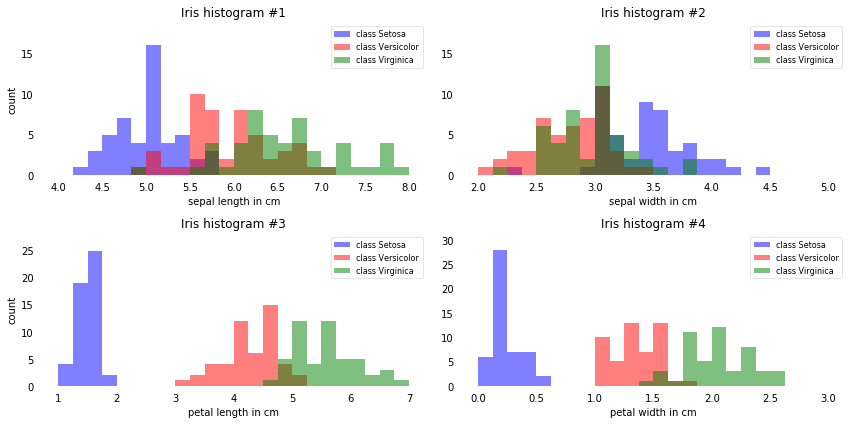
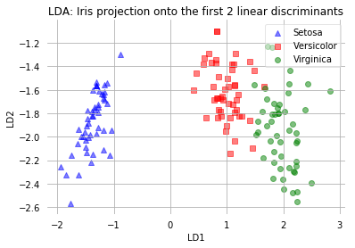

[reference](https://sebastianraschka.com/Articles/2014_python_lda.html)

### Summarizing the LDA approach in 5 steps

Listed below are the 5 general steps for performing a linear discriminant analysis; we will explore them in more detail in the following sections.

1. Compute the d-dimensional mean vectors for the different classes from the dataset.

2. Compute the scatter matrices (in-between-class and within-class scatter matrix).

3. Compute the eigenvectors (e1,e2,...,ed) and corresponding eigenvalues (λ1,λ2,...,λd) for the scatter matrices.

4. Sort the eigenvectors by decreasing eigenvalues and choose k eigenvectors with the largest eigenvalues to form a d×k dimensional matrix W (where every column represents an eigenvector).

5. Use this d×k eigenvector matrix to transform the samples onto the new subspace. This can be summarized by the matrix multiplication: Y=X×W (where X is a n×d-dimensional matrix representing the n samples, and y are the transformed n×k-dimensional samples in the new subspace).

    
    
    
 **下面五步是执行LDA分析的步骤；更细节的部分会在下面探讨**
 
 1. 计算数据集不同分组的d维平均值
 
 2. 计算散点矩阵的分类间距离矩阵和分类内部矩阵
 
 3. 计算两个矩阵的特征值和特征向量
 
 4. 按照特征值大小排序特征向量，选择k个最大特征值的特征向量组成d×k维度的W矩阵
 
 5. 使用该W矩阵转换样本到新的子空间。矩阵乘法能解释新映射子空间的特性Y(n×k) = X (n×d) × W(d×k)， Y是基于W矩阵映射后的样本矩阵


```python
import pandas as pd 

# load data from internet
df = pd.io.parsers.read_csv(
    filepath_or_buffer = 'https://archive.ics.uci.edu/ml/machine-learning-databases/iris/iris.data',
    header = None,
    sep = ",")

df.head(6)  

"""
python是面向对象语言，对象调用函数，而不是R head(df, 6)
"""
```


    '\npython是面向对象语言，对象调用函数，而不是R head(df, 6)\n'


```python
# Generate dict by for loop 
feature_dict = {i:label for i, label in zip(
    range(4),
    ('sepal length in cm',
    'sepal width in cm',
    'petal length in cm',
    'petal width in cm'))}

"""
# usage of dict 
for k,v in feature_dict.items():
    print(k,"\t" ,v)
    
# 变量命名过程
    对象调用函数，对字典的key和value进行遍历，将对应的value赋值给列
"""
# colnames for df 
df.columns = [lab for i,lab in sorted(feature_dict.items())] + ['class label']

# to drop the empty line at file-end
df.dropna(how="all", inplace=True) 
df.tail(6)
```


<div>
<style scoped>
    .dataframe tbody tr th:only-of-type {
        vertical-align: middle;
    }

    .dataframe tbody tr th {
        vertical-align: top;
    }

    .dataframe thead th {
        text-align: right;
    }
</style>
<table border="1" class="dataframe">
  <thead>
    <tr style="text-align: right;">
      <th></th>
      <th>sepal length in cm</th>
      <th>sepal width in cm</th>
      <th>petal length in cm</th>
      <th>petal width in cm</th>
      <th>class label</th>
    </tr>
  </thead>
  <tbody>
    <tr>
      <th>144</th>
      <td>6.7</td>
      <td>3.3</td>
      <td>5.7</td>
      <td>2.5</td>
      <td>Iris-virginica</td>
    </tr>
    <tr>
      <th>145</th>
      <td>6.7</td>
      <td>3.0</td>
      <td>5.2</td>
      <td>2.3</td>
      <td>Iris-virginica</td>
    </tr>
    <tr>
      <th>146</th>
      <td>6.3</td>
      <td>2.5</td>
      <td>5.0</td>
      <td>1.9</td>
      <td>Iris-virginica</td>
    </tr>
    <tr>
      <th>147</th>
      <td>6.5</td>
      <td>3.0</td>
      <td>5.2</td>
      <td>2.0</td>
      <td>Iris-virginica</td>
    </tr>
    <tr>
      <th>148</th>
      <td>6.2</td>
      <td>3.4</td>
      <td>5.4</td>
      <td>2.3</td>
      <td>Iris-virginica</td>
    </tr>
    <tr>
      <th>149</th>
      <td>5.9</td>
      <td>3.0</td>
      <td>5.1</td>
      <td>1.8</td>
      <td>Iris-virginica</td>
    </tr>
  </tbody>
</table>
</div>


**LDA是有监督分类方法， X矩阵是`sepal length in cm`,`sepal width in cm`,`petal length in cm`,`petal width in cm`四列数据构成，Y是分类变量`class label`**

1. 利用X矩阵筛选出最大特征值的特征向量，构成d×k的W矩阵


```Since it is more convenient to work with numerical values, we will use the LabelEncode from the scikit-learn library to convert the class labels into numbers: 1, 2, and 3.```

sklearn包使字符型classs label转成数字型 


**`zip` function)** 

zip() function in python3 returns an iterator.Iterator only be exhausted once,which to save memory by only generating the elements of the iterator as you need them, rather than putting it all into memory at once.If you want to reuse your zipped object, just create a list out of it as you do in your second example, and then duplicate the list by something like
```python
lis1 = [0, 1, 2, 3]
lis2 = [4, 5, 6, 7]
test2 = list(zip(lis1,lis2))
zipped_list = test2[:]
zipped_list_2 = list(test2)
```


```python
from sklearn.preprocessing import LabelEncoder
"""
提取数据，改变字符类型
"""
X = df[['sepal length in cm','sepal width in cm','petal length in cm','petal width in cm']].values
y = df['class label'].values

"""
转换字符型标签为数字标签，然后再存成字典，怎么感觉有点像R里面的因子化字符变量？？？
"""
enc = LabelEncoder()
label_encoder = enc.fit(y)
y = label_encoder.transform(y) + 1

label_dict = {1: 'Setosa', 2: 'Versicolor', 3:'Virginica'}
```

### Histograms and feature selection

Just to get a rough idea how the samples of our three classes ω1, ω2 and ω3 are distributed, let us visualize the distributions of the four different features in 1-dimensional histograms.

**柱状图和特征选择**

查看三类的数据分布类型，在一维柱状图展开

### %和%%的意义

%和%%可以使用命令行形式。%是行形式，用命令行传递参数；%%是格子形式，从cell不仅仅可以行上还可以下方获取参数。%方便代码和图在同一cell。

```
IPython has a set of predefined ‘magic functions’ that you can call with a command line style syntax. There are two kinds of magics, line-oriented and cell-oriented. Line magics are prefixed with the % character and work much like OS command-line calls: they get as an argument the rest of the line, where arguments are passed without parentheses or quotes. Lines magics can return results and can be used in the right hand side of an assignment. Cell magics are prefixed with a double %%, and they are functions that get as an argument not only the rest of the line, but also the lines below it in a separate argument
```


```python
%matplotlib inline
```

### 导入包：包的导入仍使用 import 、 from ... import 语句，使用 “圆点模块名” 的结构化模块命名空间。
    
1. 每次只导入包里的特定模块，例如： `import sound.efforts.echo`, 引用子模块的函数
`sound.effects.echo.echofilter(input, output, delay=0.7, atten=4)`
   
2. 导入包时有一个可以选择的方式： `from sound.effects import echo`这样就加载了 echo 子模块，并且使得它在没有包前缀的情况下也可以使用，
    所以它可以如下方式调用：`echo.echofilter(input, output, delay=0.7, atten=4)` 
    
3. `import * `这样的语句理论上是希望文件系统找出包中所有的子模块，然后导入它们。这可能会花长时间，并出现边界效应等。Python 解决方案是提供一个明确的包索引。

4. from . import reverse              # 同级目录 导入 reverse
5. from .. import frormats            # 上级目录 导入 frormats
6. from ..filters import equalizer      # 上级目录的filters模块下 导入 equalizer


### python 的package、module和repository的区别

`python模块`：
    自我包含并且有组织的代码片段为模块。表现形式为：写的代码保存为文件。这个文件就是一个模块。sample.py 其中文件名smaple为模块名字。
    
 `python包`：包是一个有层次的文件目录结构，它定义了由n个模块或n个子包组成的python应用程序执行环境.通俗一点：包是一个包含__init__.py 文件的目录，该目录下一定得有这个__init__.py文件和其它模块或子包。
 
`python库`: 参考其它编程语言的说法，就是指python中的完成一定功能的代码集合，供用户使用的代码组合。在python中是包和模块的形式。


```python
from matplotlib import pyplot as plt
import numpy as np
import math


# 设置画板的图数目和图的大小
## fig:图   axes:图位置
fig, axes = plt.subplots(nrows=2, ncols=2, figsize=(12, 6))


# ax: fig postion  cnt: colnames to be draw fig
for ax, cnt in zip(axes.ravel(), range(4)):
    
    # set bin size for each col
    min_b = math.floor(np.min(X[:, cnt]))
    max_b = math.ceil(np.max(X[:, cnt]))
    bins = np.linspace(min_b, max_b, 25) 
    
    # plottling the histograms for three class in four labs
    ## lab是分类 1， 2，3； col是分组对应得颜色
    for lab,col in zip(range(1,4), ('blue', 'red', 'green')):
        ax.hist(X[y==lab, cnt],
                   color=col,
                   label='class %s' %label_dict[lab],
                   bins=bins,
                   alpha=0.5)
    ylims = ax.get_ylim()
    
    # 画图逻辑：x轴->原始数据；y轴->出现的次数 
    
    # plot annotation
    leg = ax.legend(loc='upper right', fancybox=True, fontsize=8)
    leg.get_frame().set_alpha(0.5)
    ax.set_ylim([0, max(ylims)+2])
    ax.set_xlabel(feature_dict[cnt])
    ax.set_title('Iris histogram #%s' %str(cnt+1))

    # hide axis ticks
    ax.tick_params(axis="both", which="both", bottom="off", top="off",  
            labelbottom="on", left="off", right="off", labelleft="on")

    # remove axis spines
    ax.spines["top"].set_visible(False)  
    ax.spines["right"].set_visible(False)
    ax.spines["bottom"].set_visible(False)
    ax.spines["left"].set_visible(False)    

axes[0][0].set_ylabel('count')
axes[1][0].set_ylabel('count')

fig.tight_layout()       

plt.show()
```

    E:\software\Anaconda3\lib\site-packages\matplotlib\cbook\deprecation.py:107: MatplotlibDeprecationWarning: Passing one of 'on', 'true', 'off', 'false' as a boolean is deprecated; use an actual boolean (True/False) instead.
      warnings.warn(message, mplDeprecation, stacklevel=1)
    





```From just looking at these simple graphical representations of the features, we can already tell that the petal lengths and widths are likely better suited as potential features two separate between the three flower classes. In practice, instead of reducing the dimensionality via a projection (here: LDA), a good alternative would be a feature selection technique.```

# LDA in 5 steps

After we went through several preparation steps, our data is finally ready for the actual LDA. In practice, LDA for dimensionality reduction would be just another preprocessing step for a typical machine learning or pattern classification task.


### step 1 : Computing the d-dimensional mean vectors

In this first step, we will start off with a simple computation of the mean vectors mmi, (i=1,2,3) of the 3 different flower classes:

    mean(i) =[sepal length, sepal width, petal length, petal width], with i = 1, 2, 3


```python
np.set_printoptions(precision=4)

mean_vectors = []
for cl in range(1,4):
    mean_vectors.append(np.mean(X[y==cl], axis=0))
    print('Mean Vector class %s: %s\n' %(cl, mean_vectors[cl-1]))
```

    Mean Vector class 1: [ 5.006  3.418  1.464  0.244]
    
    Mean Vector class 2: [ 5.936  2.77   4.26   1.326]
    
    Mean Vector class 3: [ 6.588  2.974  5.552  2.026]
    
    

### Step 2: Computing the Scatter Matrices 


Now, we will compute the two 4x4-dimensional matrices: The within-class and the between-class scatter matrix.

`2.1 Within-class scatter matrix Sw`

The **within-class** scatter matrix Sw is computed by the following equation:

                            Sw=∑Si
where
            Si=∑(x−mi)(x−mi)T
(scatter matrix for every class)

and mi is the mean vector 
        mi=1/ni∑xk


```python
S_W = np.zeros((4,4))
for cl,mv in zip(range(1,4), mean_vectors):
    class_sc_mat = np.zeros((4,4))                  # scatter matrix for every class
    for row in X[y == cl]:
        row, mv = row.reshape(4,1), mv.reshape(4,1) # make column vectors
        class_sc_mat += (row-mv).dot((row-mv).T)
    S_W += class_sc_mat                             # sum class scatter matrices
print('within-class Scatter Matrix:\n', S_W)
```

    within-class Scatter Matrix:
     [[ 38.9562  13.683   24.614    5.6556]
     [ 13.683   17.035    8.12     4.9132]
     [ 24.614    8.12    27.22     6.2536]
     [  5.6556   4.9132   6.2536   6.1756]]
    

`2.2 Between-class scatter matrix Sb`

The between-class scatter matrix SB is computed by the following equation:

        Sb=∑(mi−m)(mi−m)T
where
    `m` is the overall mean, and mi and Ni are the sample mean and sizes of the respective classes.


```python
overall_mean = np.mean(X, axis=0)

S_B = np.zeros((4,4))
for i,mean_vec in enumerate(mean_vectors):  
    n = X[y==i+1,:].shape[0]
    mean_vec = mean_vec.reshape(4,1) # make column vector
    overall_mean = overall_mean.reshape(4,1) # make column vector
    S_B += n * (mean_vec - overall_mean).dot((mean_vec - overall_mean).T)

print('between-class Scatter Matrix:\n', S_B)
```

    between-class Scatter Matrix:
     [[  63.2121  -19.534   165.1647   71.3631]
     [ -19.534    10.9776  -56.0552  -22.4924]
     [ 165.1647  -56.0552  436.6437  186.9081]
     [  71.3631  -22.4924  186.9081   80.6041]]
    

### Step 3: Solving the generalized eigenvalue problem for the matrix S−1WSb

Next, we will solve the generalized eigenvalue problem for the matrix S−1WSB to obtain the linear discriminants.


```python
eig_vals, eig_vecs = np.linalg.eig(np.linalg.inv(S_W).dot(S_B))

for i in range(len(eig_vals)):
    eigvec_sc = eig_vecs[:,i].reshape(4,1)   
    print('\nEigenvector {}: \n{}'.format(i+1, eigvec_sc.real))
    print('Eigenvalue {:}: {:.2e}'.format(i+1, eig_vals[i].real))
```

    
    Eigenvector 1: 
    [[-0.2049]
     [-0.3871]
     [ 0.5465]
     [ 0.7138]]
    Eigenvalue 1: 3.23e+01
    
    Eigenvector 2: 
    [[-0.009 ]
     [-0.589 ]
     [ 0.2543]
     [-0.767 ]]
    Eigenvalue 2: 2.78e-01
    
    Eigenvector 3: 
    [[-0.8844]
     [ 0.2854]
     [ 0.258 ]
     [ 0.2643]]
    Eigenvalue 3: 3.42e-15
    
    Eigenvector 4: 
    [[-0.2234]
     [-0.2523]
     [-0.326 ]
     [ 0.8833]]
    Eigenvalue 4: 1.15e-14
    


```python
"""
Checking the eigenvector-eigenvalue calculation
A quick check that the eigenvector-eigenvalue calculation is correct and satisfy the equation:
"""
for i in range(len(eig_vals)):
    eigv = eig_vecs[:,i].reshape(4,1)
    np.testing.assert_array_almost_equal(np.linalg.inv(S_W).dot(S_B).dot(eigv),
                                         eig_vals[i] * eigv,
                                         decimal=6, err_msg='', verbose=True)
print('ok')
```

    ok
    

### Step 4: Selecting linear discriminants for the new feature subspace

**`4.1. Sorting the eigenvectors by decreasing eigenvalues`**


```
Remember from the introduction that we are not only interested in merely projecting the data into a subspace that improves the class separability, but also reduces the dimensionality of our feature space, (where the eigenvectors will form the axes of this new feature subspace).

However, the eigenvectors only define the directions of the new axis, since they have all the same unit length 1.

So, in order to decide which eigenvector(s) we want to drop for our lower-dimensional subspace, we have to take a look at the corresponding eigenvalues of the eigenvectors. Roughly speaking, the eigenvectors with the lowest eigenvalues bear the least information about the distribution of the data, and those are the ones we want to drop.
The common approach is to rank the eigenvectors from highest to lowest corresponding eigenvalue and choose the top k eigenvectors.
```


```python
# Make a list of (eigenvalue, eigenvector) tuples
eig_pairs = [(np.abs(eig_vals[i]), eig_vecs[:,i]) for i in range(len(eig_vals))]

# Sort the (eigenvalue, eigenvector) tuples from high to low
eig_pairs = sorted(eig_pairs, key=lambda k: k[0], reverse=True)

# Visually confirm that the list is correctly sorted by decreasing eigenvalues
print('Eigenvalues in decreasing order:\n')
for i in eig_pairs:
    print(i[0])
```

    Eigenvalues in decreasing order:
    
    32.2719577997
    0.27756686384
    1.14833622793e-14
    3.42245892085e-15
    


```python
"""
If we take a look at the eigenvalues, we can already see that 2 eigenvalues are close to 0. The reason why these are close
to 0 is not that they are not informative but it’s due to floating-point imprecision. In fact, these two last eigenvalues 
should be exactly zero
"""
print('Variance explained:\n')
eigv_sum = sum(eig_vals)
for i,j in enumerate(eig_pairs):
    print('eigenvalue {0:}: {1:.2%}'.format(i+1, (j[0]/eigv_sum).real))
```

    Variance explained:
    
    eigenvalue 1: 99.15%
    eigenvalue 2: 0.85%
    eigenvalue 3: 0.00%
    eigenvalue 4: 0.00%
    

**`4.2. Choosing k eigenvectors with the largest eigenvalues`**

After sorting the eigenpairs by decreasing eigenvalues, it is now time to construct our k×d-dimensional eigenvector matrix WW (here 4×2: based on the 2 most informative eigenpairs) and thereby reducing the initial 4-dimensional feature space into a 2-dimensional feature subspace.


```python
W = np.hstack((eig_pairs[0][1].reshape(4,1), eig_pairs[1][1].reshape(4,1)))
print('Matrix W:\n', W.real)
```

    Matrix W:
     [[-0.2049 -0.009 ]
     [-0.3871 -0.589 ]
     [ 0.5465  0.2543]
     [ 0.7138 -0.767 ]]
    

### Step 5: Transforming the samples onto the new subspace

In the last step, we use the 4×2-dimensional matrix W that we just computed to transform our samples onto the new subspace via the equation

   **Y=X×W**

(where X is a n×d-dimensional matrix representing the n samples, and Y are the transformed n×k-dimensional samples in the new subspace).


```python
X_lda = X.dot(W)
assert X_lda.shape == (150,2), "The matrix is not 150x2 dimensional."

from matplotlib import pyplot as plt

def plot_step_lda():

    ax = plt.subplot(111)
    for label,marker,color in zip(
        range(1,4),('^', 's', 'o'),('blue', 'red', 'green')):

        plt.scatter(x=X_lda[:,0].real[y == label],
                y=X_lda[:,1].real[y == label],
                marker=marker,
                color=color,
                alpha=0.5,
                label=label_dict[label]
                )

    plt.xlabel('LD1')
    plt.ylabel('LD2')

    leg = plt.legend(loc='upper right', fancybox=True)
    leg.get_frame().set_alpha(0.5)
    plt.title('LDA: Iris projection onto the first 2 linear discriminants')

    # hide axis ticks
    plt.tick_params(axis="both", which="both", bottom="off", top="off",  
            labelbottom="on", left="off", right="off", labelleft="on")

    # remove axis spines
    ax.spines["top"].set_visible(False)  
    ax.spines["right"].set_visible(False)
    ax.spines["bottom"].set_visible(False)
    ax.spines["left"].set_visible(False)    

    plt.grid()
    plt.tight_layout
    plt.show()

plot_step_lda()
```

    E:\software\Anaconda3\lib\site-packages\matplotlib\cbook\deprecation.py:107: MatplotlibDeprecationWarning: Passing one of 'on', 'true', 'off', 'false' as a boolean is deprecated; use an actual boolean (True/False) instead.
      warnings.warn(message, mplDeprecation, stacklevel=1)
    





**The scatter plot above represents our new feature subspace that we constructed via LDA. We can see that the first linear discriminant “LD1” separates the classes quite nicely. However, the second discriminant, “LD2”, does not add much valuable information, which we’ve already concluded when we looked at the ranked eigenvalues is step 4**

## pandas的DataFrame选择行或者列


```python
import numpy as np
import pandas as pd
from pandas import DataFrame

#ser = Series(np.arange(3.))

data = DataFrame(np.arange(16).reshape(4,4),index=list('abcd'),columns=list('wxyz'))

data['w']  #选择表格中的'w'列，使用类字典属性,返回的是Series类型

data.w    #选择表格中的'w'列，使用点属性,返回的是Series类型

data[['w']]  #选择表格中的'w'列，返回的是DataFrame类型

data[['w','z']]  #选择表格中的'w'、'z'列

data[0:2]  #返回第1行到第2行的所有行，前闭后开，包括前不包括后

data[1:2]  #返回第2行，从0计，返回的是单行，通过有前后值的索引形式，
       #如果采用data[1]则报错

data.ix[1:2] #返回第2行的第三种方法，返回的是DataFrame，跟data[1:2]同

data['a':'b']  #利用index值进行切片，返回的是**前闭后闭**的DataFrame, 
        #即末端是包含的  

#————————————————————————————-----------------

data.head()  #返回data的前几行数据，默认为前五行，需要前十行则data.head(10)
data.tail()  #返回data的后几行数据，默认为后五行，需要后十行则data.tail(10)
```

    E:\software\Anaconda3\lib\site-packages\ipykernel_launcher.py:22: DeprecationWarning: 
    .ix is deprecated. Please use
    .loc for label based indexing or
    .iloc for positional indexing
    
    See the documentation here:
    http://pandas.pydata.org/pandas-docs/stable/indexing.html#ix-indexer-is-deprecated
    


<div>
<style scoped>
    .dataframe tbody tr th:only-of-type {
        vertical-align: middle;
    }

    .dataframe tbody tr th {
        vertical-align: top;
    }

    .dataframe thead th {
        text-align: right;
    }
</style>
<table border="1" class="dataframe">
  <thead>
    <tr style="text-align: right;">
      <th></th>
      <th>w</th>
      <th>x</th>
      <th>y</th>
      <th>z</th>
    </tr>
  </thead>
  <tbody>
    <tr>
      <th>a</th>
      <td>0</td>
      <td>1</td>
      <td>2</td>
      <td>3</td>
    </tr>
    <tr>
      <th>b</th>
      <td>4</td>
      <td>5</td>
      <td>6</td>
      <td>7</td>
    </tr>
    <tr>
      <th>c</th>
      <td>8</td>
      <td>9</td>
      <td>10</td>
      <td>11</td>
    </tr>
    <tr>
      <th>d</th>
      <td>12</td>
      <td>13</td>
      <td>14</td>
      <td>15</td>
    </tr>
  </tbody>
</table>
</div>


